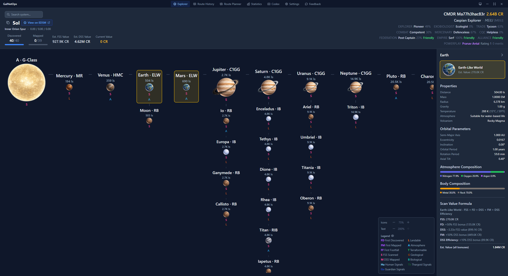
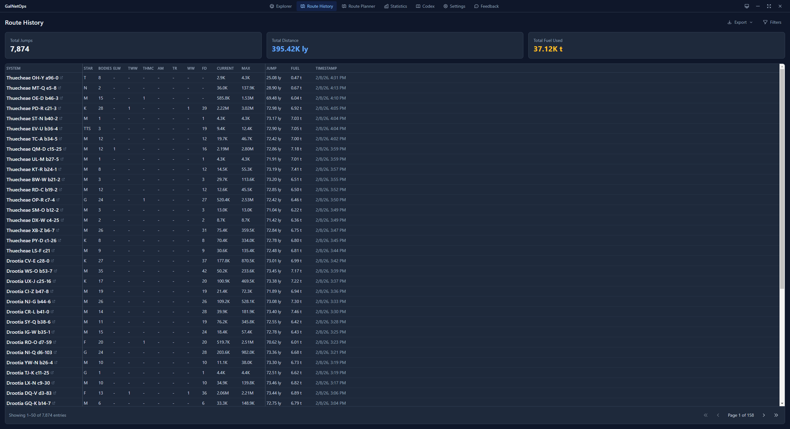
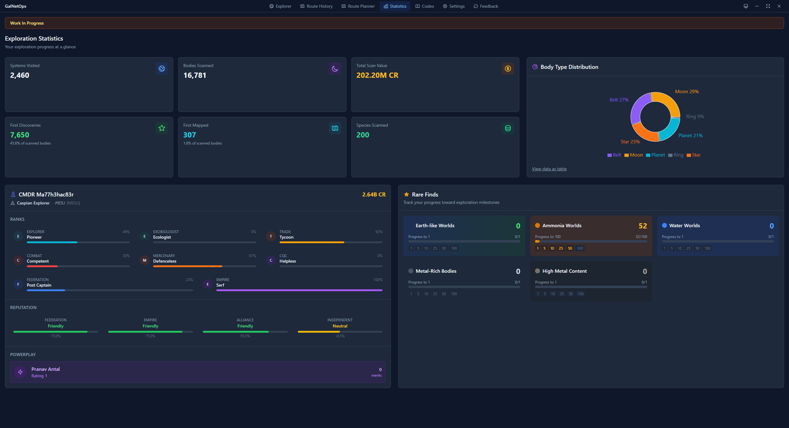

# Galaxy Network Operations (GalNetOps)

**Real-time exploration companion for Elite Dangerous**

GalNetOps reads your journal files and gives you live system visualization, accurate scan values, route history, exobiology tracking, exploration statistics, and route planning - all in a modern, responsive interface.

### **Why GalNetOps?**

1. Real-time updates - FSS, DSS, and Genetic Sampling scans appear instantly as you explore.
2. Accurate value calculations - Base values, first discovery bonuses, terraformable bonuses, efficiency bonuses - all computed correctly (hopefully).
3. Clean system visualization - Hierarchical tree view with body types, signals, and scan status at a glance.
4. Route history with context - See where you've been, what you found, and what it was worth.
5. Exobiology tracking - Species estimator based on system/body properties to help you decide if it's worth your time. Species progress, sample distances, and earnings per genus.
6. Route planner - Input a list of system names and POIs to add in your expeditions.

* This program does not upload or read any data from your Elite Dangerous account, EDSM profile, Inara profile etc. All data is read from your journal files local to your file system.
* As [EDMC](https://github.com/EDCD/EDMarketConnector/wiki) can do all the backend updating it is highly recommended you run this program alongside it.

---

### **Features**

#### **Explorer**
Live system map with hierarchical body layout, scan status indicators, and a details panel showing orbital parameters, ring systems, biological species, and estimated values.



#### **Route History**
Paginated jump log with filtering by date, session, or system name. Export to CSV/JSON or copy system names to clipboard.



#### **Statistics**
Exploration metrics and trends: systems visited, first discoveries, scan values over time, body type distribution, and exobiology progress.



#### **Codex**
Track your discoveries across biology, geology, anomalies, Thargoid, and Guardian categories.


#### **Settings**
Journal path detection, theme selection, value thresholds, EDSM integration, database management, and journal backfill.

#### **Feedback**
A simple button that takes you directly to a new GitHub issue to submit your feedback.

---

### **Versioning**

- This project follows [Semantic Version 2.0.0](https://semver.org/): MAJOR.MINOR.PATCH
- Current version is **1.0.0-beta.1**.

### **Installation**

#### **From Release**

1. Download the latest installer from [Releases](https://github.com/Ma77h3hac83r/GalNetOps/releases)
2. Run the installer
3. Launch GalNetOps and select your journal folder. See the settings tab for further customization.

#### **From Source**

* Clone this repository.
```bash
npm install
npm run dev        # Development mode
npm run build      # Production build
npm run package    # Create Windows installer
```
* On first launch, GalNetOps will prompt you to select your journal folder and optionally import your exploration history.

---

### **Data Sources**

- Local journal files - Primary data source, parsed in real-time
- EDSM - Optional body count lookups and system search (respects spoiler-free setting)
- Your exploration data stays local in a SQLite database. Nothing is uploaded.

---

### **Contributing**

Contributions welcome. Please open a [issue](https://github.com/Ma77h3hac83r/GalNetOps/issues) to submit a request. Bug reports always welcome.

---

### **License**

[MIT](LICENSE)

---

### **Acknowledgments**

- [EDSM](https://www.edsm.net/) for exisiting galactic data.
- Frontier for developing [Elite Dangerous](https://www.elitedangerous.com/en-US).